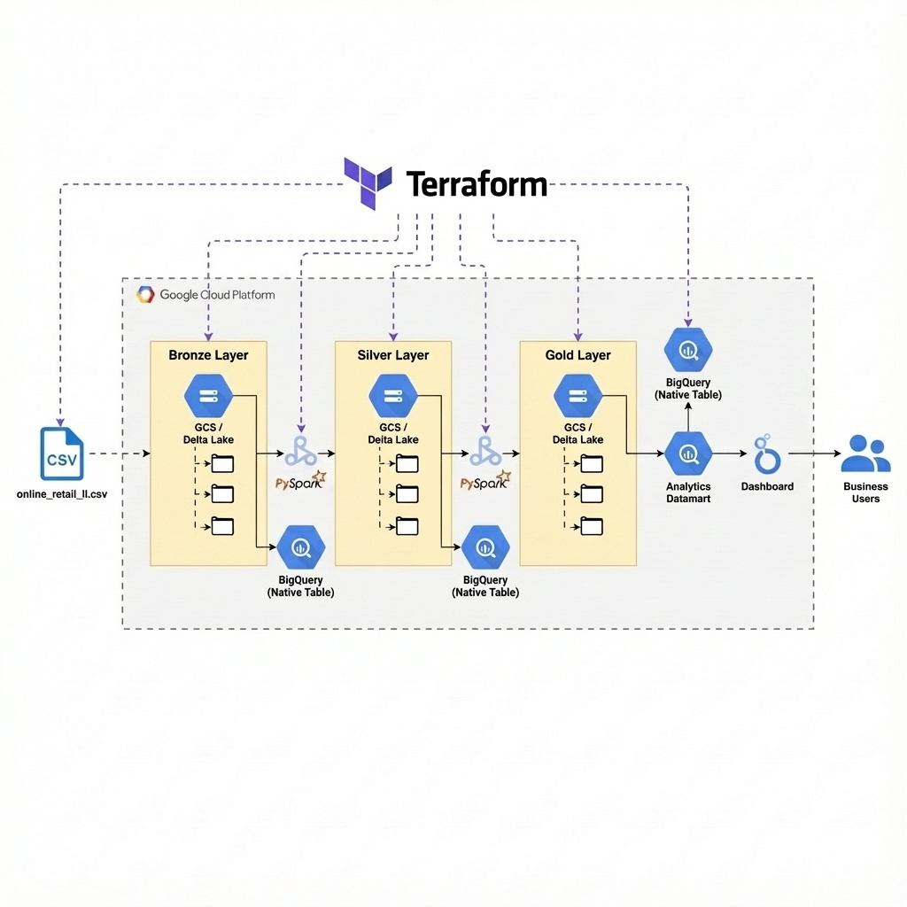
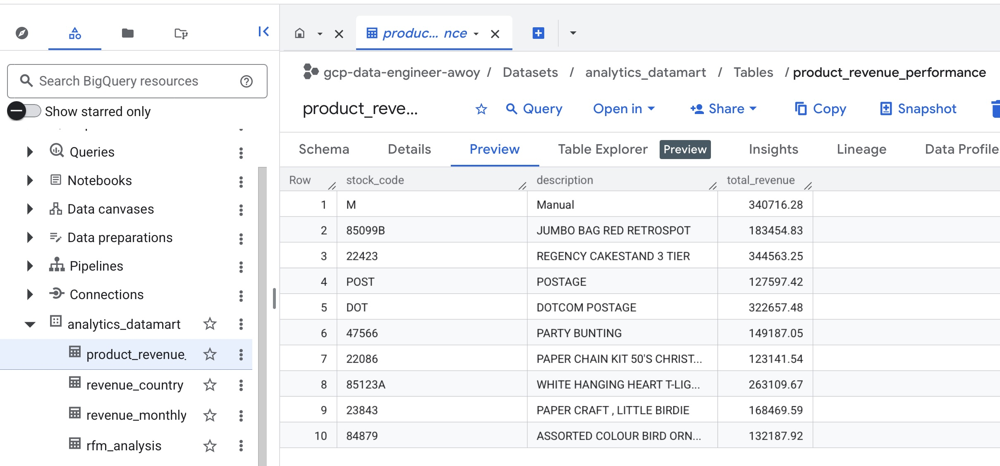
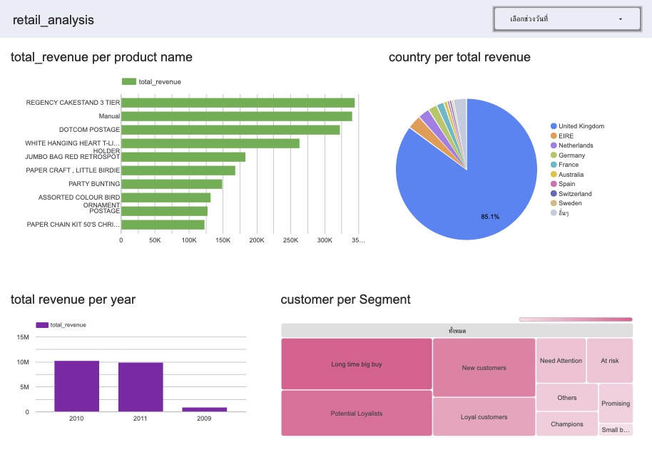
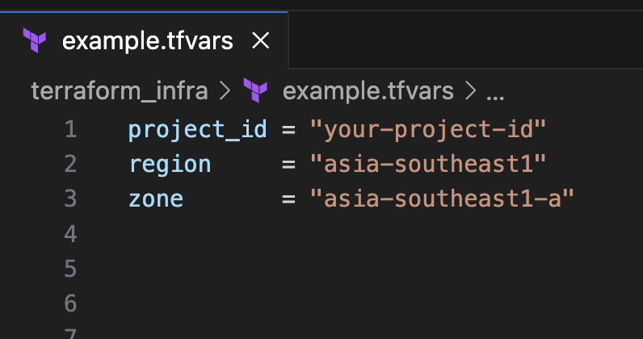
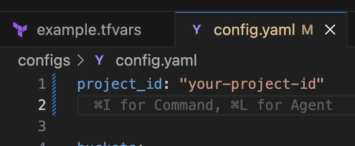
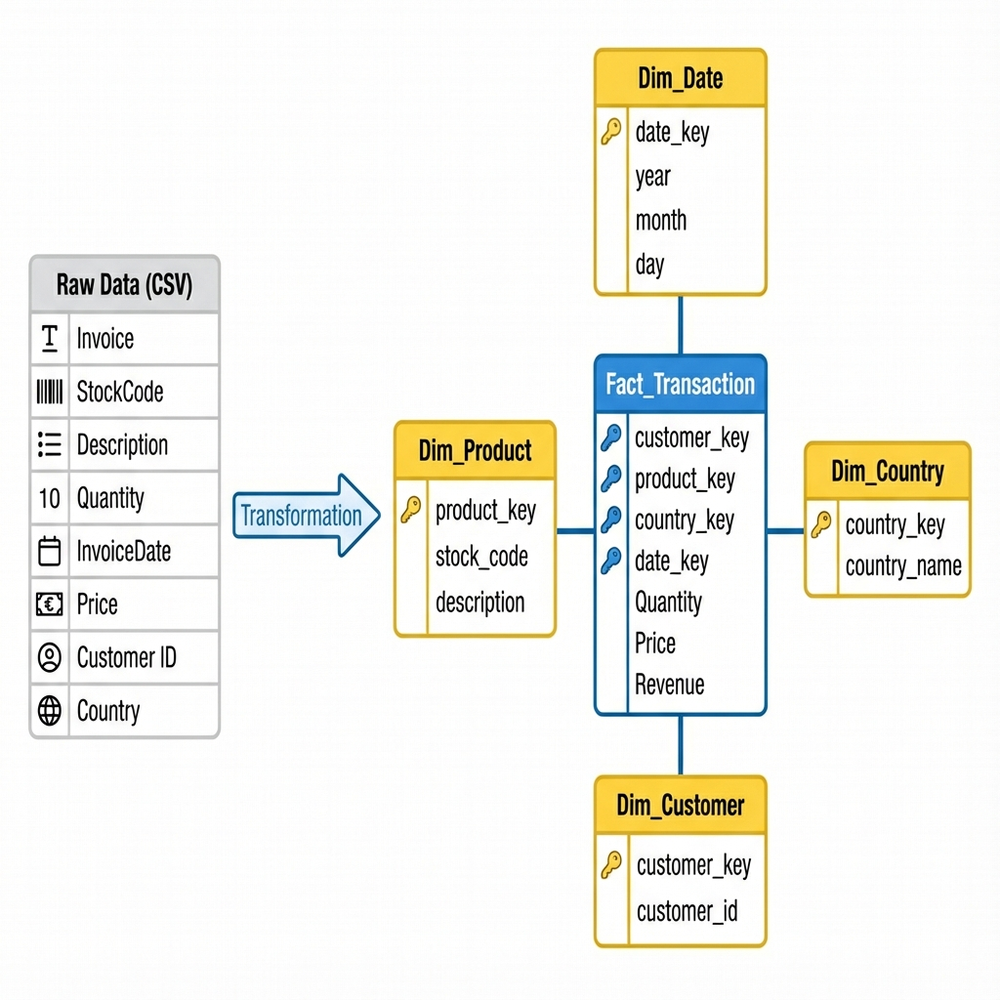

# Medallion Architecture with Dataproc Spark & Delta Lake

This project demonstrates a complete **ETL pipeline** using **Google Cloud Dataproc (Serverless Batch)**, **Apache Spark**, and **Delta Lake**. It implements a **Medallion Architecture** (Bronze, Silver, Gold) to transform raw e-commerce data into actionable insights, including a comprehensive **RFM (Recency, Frequency, Monetary) Analysis**.
data from Kagle follow by this link : https://www.kaggle.com/datasets/mashlyn/online-retail-ii-uci/data

## 🎯 What I Learned

This project was built to master **Cloud Data Engineering** concepts using **Google Cloud Platform (GCP)**. Key learning outcomes include:

-   **Infrastructure as Code (IaC)**: Provisioning and managing full GCP infrastructure using **Terraform**.
-   **Data Architecture**: Implementing the **Medallion Architecture** (Bronze, Silver, Gold) using the **Delta Lake** format.
-   **Data Modeling**: Designing a **Star Schema** (Fact & Dimension tables) for the Data Warehouse.
-   **Spark Optimization**: Using **Dataproc Serverless** and optimizing PySpark jobs with techniques like:
    -   Broadcast Joins
    -   Partitioning
    -   Caching
    -   SCD Type 2 logic
    -   Early Filtering (Predicate Pushdown)
-   **BigQuery Optimization**: Implementing **Partitioning** and **Clustering** for efficient querying.
-   **Analytics & Visualization**:
    -   Conducting **RFM Analysis** for customer segmentation.
    -   Building interactive dashboards with **Looker Studio**.

> **Disclaimer**: This project is for educational purposes. In a production environment, storing data in both Delta Lake (GCS) and BigQuery Native Tables simultaneously is typically redundant. A common pattern would be to use BigLake tables to query Delta Lake directly from BigQuery.
---
## 🏛️ Architecture Overview



The pipeline follows the **Medallion Architecture** pattern and integrates with **Looker Studio** for visualization.

## 📊 Result Outcome

### BigQuery Analysis

The final Gold layer(agg mart) data in BigQuery, showing the calculated top 10 revenue of products.

### Looker Studio Dashboard

An interactive dashboard built on top of the BigQuery data, visualizing key metrics like revenue trends, product performance, and customer segmentation.

---

## ✅ Prerequisites

1.  **Google Cloud Platform Account** with billing enabled.
2.  **Google Cloud SDK** (`gcloud`) installed and authenticated.
3.  **Terraform** installed.
4.  **Python 3.9+** (for local development).

---

## 🛠️ Tools Used

-   **Compute**: Google Cloud Dataproc (Serverless Batch)
-   **Processing Engine**: Apache Spark (PySpark)
-   **Storage Format**: Delta Lake (Open Source)
-   **Data Warehouse**: Google BigQuery
-   **Infrastructure as Code**: Terraform
-   **Orchestration**: Terraform (for resource provisioning & job submission)
-   **Language**: Python

## 📁 Project Structure

```bash
.
├── configs/                 # Configuration files (YAML)
├── data/                    # Raw data files (CSV)
├── jobs/                    # PySpark job scripts
│   ├── main_spark.py       # Main ETL logic (Bronze -> Silver -> Gold)
│   └── utils.py            # Utility functions (SCD Type 2, BigQuery upload)
├── terraform_infra/         # Terraform infrastructure code
│   ├── main.tf             # Main Terraform configuration
│   ├── variables.tf        # Variable definitions
│   └── outputs.tf          # Output definitions
└── README.md                # Project documentation
```

---

## 🚀 Quick Start

### 1. Clone the Repository
```bash
git clone https://github.com/zzzawoyzzz/retail-analytics-dataproc.git
cd retail-analytics-dataproc
```

### 2. Authenticate with Google Cloud
```bash
# Login to your Google Cloud account
gcloud auth login

# Set application default credentials (required for Terraform)
gcloud auth application-default login

# Set your project ID
gcloud config set project <YOUR_PROJECT_ID>
```

### 3. Prepare Data
Ensure your raw data file `online_retail_II.csv` is placed in the `data/` directory.

### 4. Setup configuration file

Set up the configuration file (`terraform_infra/example.tfvars`) with your project ID, region, and zone.

Also, update the PySpark configuration file (`configs/config.yaml`) with your `project_id`:
```yaml
project_id: "your-project-id"
```



### 5. Deploy Infrastructure & Run Job
Navigate to the Terraform directory and apply the configuration. This will create GCS buckets, enable APIs, upload scripts/data, and **submit the Dataproc Batch job**.

**5.1 change directory to terraform_infra folder**
```bash
cd terraform_infra
```
**5.2 initialize terraform**
```bash
terraform init
```

**5.3 apply terraform**
```bash
terraform apply -auto-approve
```

### 6. Verify Results
Once the Terraform apply completes (and the Dataproc job finishes), check **BigQuery**:
-   **Dataset**: `analytics_datawarehouse` (Silver Tables)
-   **Dataset**: `analytics_datamart` (Gold Tables)

### 7. Clean Up
Navigate to the Terraform directory and apply the configuration. This will create GCS buckets, enable APIs, upload scripts/data, and **submit the Dataproc Batch job**.

**7.1 change directory to terraform_infra**
```bash
cd terraform_infra
```
**7.2 apply terraform**
```bash
terraform destroy -auto-approve
```

### 8. (Optional) Rerun the Job
Navigate to the Terraform directory and apply the configuration. This will create GCS buckets, enable APIs, upload scripts/data, and **submit the Dataproc Batch job**.

**8.1 Change directory to terraform_infra**
```bash
cd terraform_infra
```

**8.2 Generate random id for create new dataproc batch and apply terraform**
```bash
terraform taint random_id.dataproc_batch && terraform apply -auto-approve
```

---

### 🌊 Data Flow

1.  **Ingest**: Raw CSV data (`online_retail_II.csv`) is uploaded to GCS.
2.  **Bronze Layer (Raw)**:
    -   Reads CSV data.
    -   Adds metadata (ingestion time, source system).
    -   Writes to **Delta Lake** (GCS) partitioned by date.
    -   **Syncs to BigQuery** (Native Table). (remark: purpose for dev environment only) 
3.  **Silver Layer (Cleaned & Normalized)**:
    -   Performs data cleansing (removes cancellations, handles nulls).
    -   Implements **Star Schema**:
        -   **Dimensions**: Customer, Product, Country, Date (SCD Type 2 logic).
        -   **Fact**: Transactions.
    -   Writes to **Delta Lake** and **Syncs to BigQuery**.

## 📐 Data Modeling (Star Schema)



The raw data is transformed into a **Star Schema** optimized for analytics:
-   **Fact Table**: `fact_transaction` contains quantitative data (Quantity, Price, Revenue).
-   **Dimension Tables**: Provide context (`dim_customer`, `dim_product`, `dim_country`, `dim_date`) and support **SCD Type 2** for historical tracking.

4.  **Gold Layer (Aggregated & Business Logic)**:
    -   Calculates business metrics:
        -   Monthly Revenue
        -   Product Performance
        -   Revenue by Country
    -   Performs **RFM Analysis** to segment customers.
    -   Writes to **Delta Lake** and **Syncs to BigQuery** (Datamart).
5.  **Visualization**:
    -   **Looker Studio** connects to the BigQuery Gold tables to visualize key metrics and customer segments.

---


## 📊 Data Transformations

### 🥉 Bronze Layer
-   **Source**: Raw CSV files.
-   **Transformation**: Schema validation, adding `ingestion_timestamp`.
-   **Output**: Delta Table (Partitioned by Date).

### 🥈 Silver Layer
-   **Dimensions**:
    -   `dim_customer`: Unique customers with SCD Type 2 tracking.
    -   `dim_product`: Unique products with descriptions.
    -   `dim_country`: Country reference.
    -   `dim_date`: Calendar date dimension.
-   **Fact**:
    -   `fact_transaction`: Transactional data linked to dimension keys.
-   **Logic**: Filters out cancelled orders (Invoice starting with 'C').

### 🥇 Gold Layer
-   **Revenue Monthly**: Aggregated revenue by Year/Month.
-   **Product Performance**: Top 10 products by revenue.
-   **Revenue Country**: Total revenue by country.
-   **RFM Analysis**:
    -   Calculates **Recency** (days since last purchase), **Frequency** (count of orders), and **Monetary** (total spend).
    -   Scores customers 1-5 for each metric.
    -   Segments customers into 10 categories (e.g., "Champions", "Loyal", "At Risk").

---

## 🔧 Key Features: RFM Segmentation

The pipeline automatically segments customers into the following groups based on their purchasing behavior:

| Segment | Description |
| :--- | :--- |
| 🏆 **Champions** | Bought recently, buy often, and spend the most. |
| 💎 **Loyal Customers** | Buy regularly and recently. |
| 🌟 **Potential Loyalists** | Recent customers with good potential. |
| 🆕 **New Customers** | Bought recently but not frequently. |
| 📈 **Promising** | Recent shoppers but low spend. |
| ⚠️ **Need Attention** | Above average behavior but showing signs of decline. |
| 💰 **Long Time Big Buy** | High spenders who haven't bought in a while. |
| 🛒 **Small Basket Size** | Recent buyers with low spend. |
| 📉 **At Risk** | Haven't purchased recently and low frequency. |
| 💤 **Hibernating** | Long time since purchase, low frequency. |

---

## 📈 Monitoring & Observability

-   **Dataproc Batches**: Monitor job status and logs in the [Google Cloud Console > Dataproc > Batches](https://console.cloud.google.com/dataproc/batches).
-   **BigQuery**: Query the final tables to visualize the results.

## 🧹 Cleanup

To destroy all resources created by this project (Buckets, Datasets, etc.):

```bash
cd terraform_infra
terraform destroy -auto-approve
```